# Introdução a protocolos Web (HTTP e HTTPS)

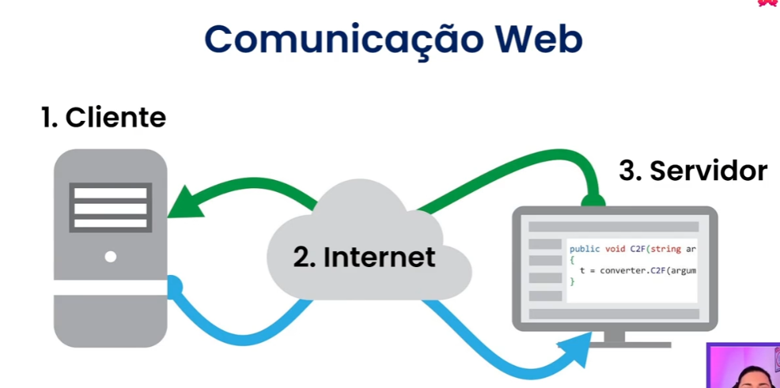

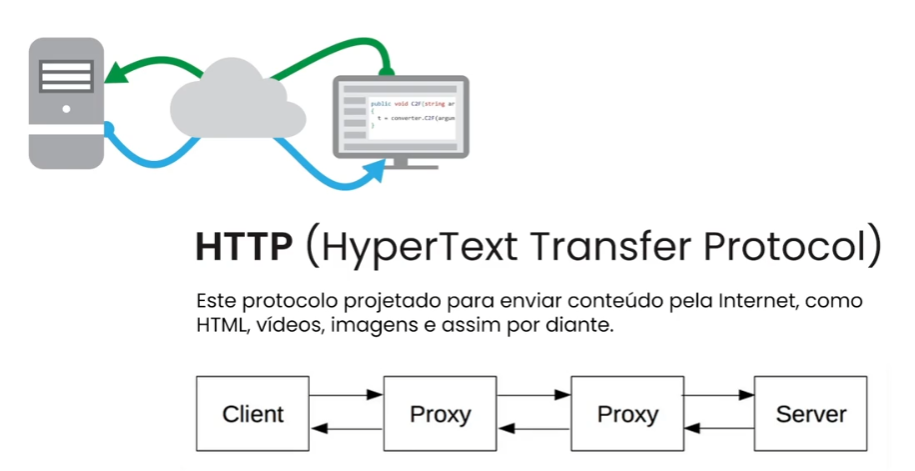

- Proxy:
  - Um intermediário entre o cliente e o servidor.
  - Pode ser usado para mascarar o IP do cliente.
  - Pode ser usado para bloquear o acesso a determinados sites.

# Métodos de requisição HTTP
- GET: Obter informações do servidor.
- POST: Enviar informações para o servidor.
- PUT: Atualizar informações no servidor.
- DELETE: Deletar informações no servidor.
- PATCH: Atualizar parcialmente informações no servidor.

## Elementos de uma requisição HTTP:
  - 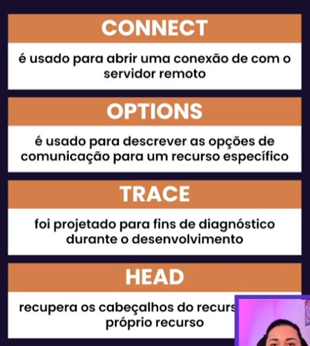

# Http status code
- https://http.cat/
- 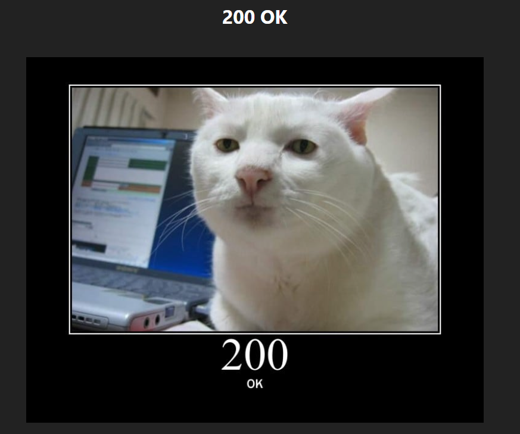

## Conhecendo HTTPS
- 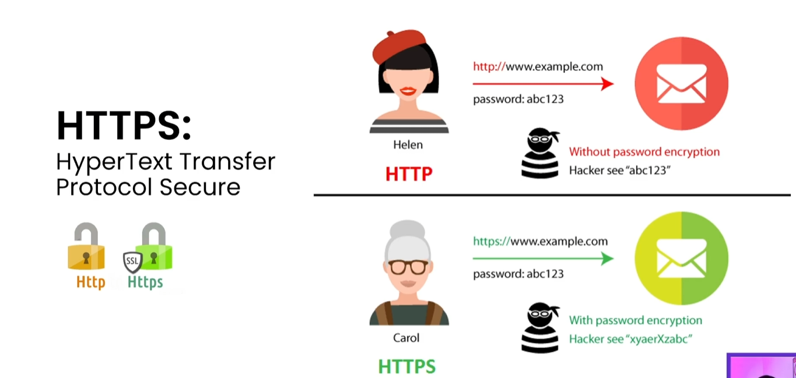
- Certificado SSL: É um arquivo de dados que vincula uma chave criptográfica às informações de uma organização ou indivíduo.

# Introdução a APIs
- API: Application Programming Interface
- 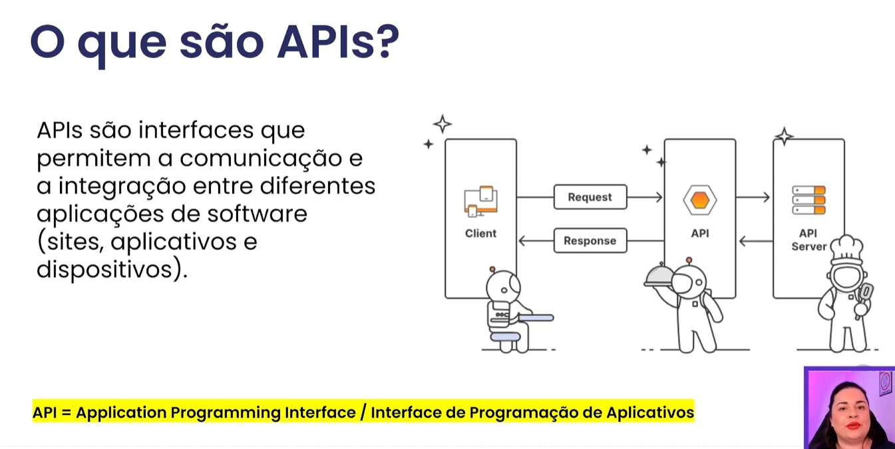
- 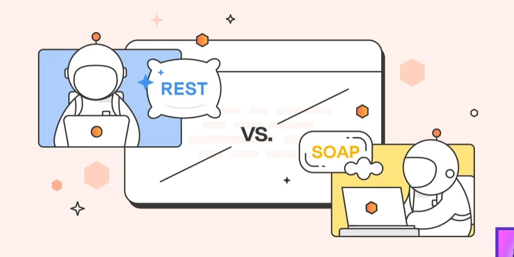
- 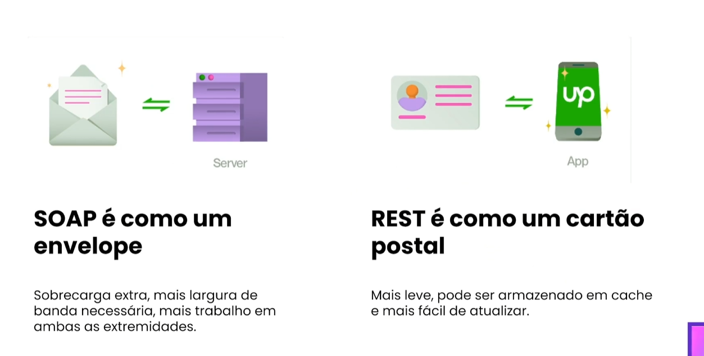
- 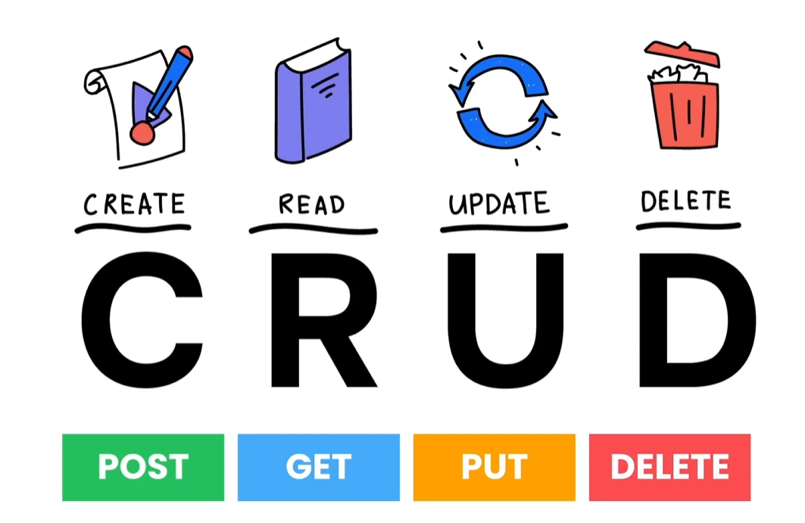

# Estrutura de uma Rest API com Json
- 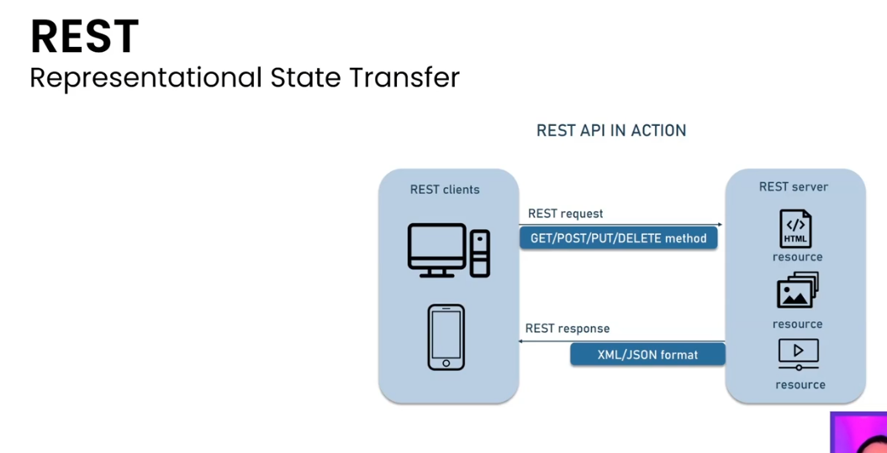
- 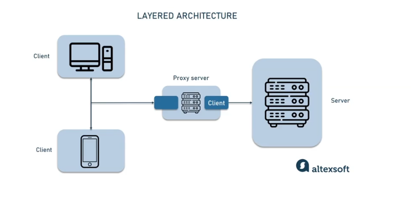 -> resposta de uma requisição HTTP
- o arquivo json ele vai trazer os dados que a gente quer, e o status code vai dizer se a requisição foi bem sucedida ou não.
- https://json-schema.org/

# Introdução ao flask
- Flask é um micro framework para Python, para cirar aplicações web.