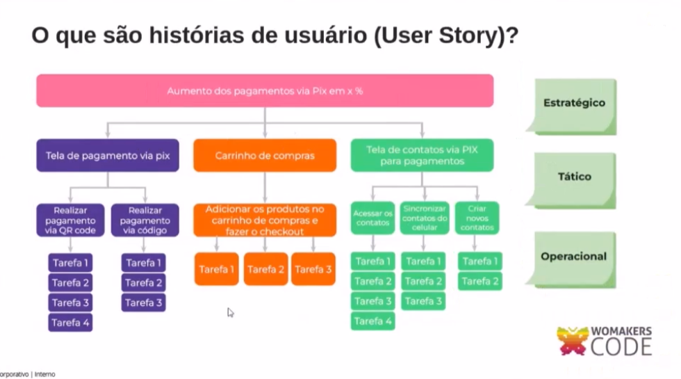

## 12 princípios da Agilidade

- Satisfaça o cliente através da entrega continua de valor

- mudanças são bem vindas, a agilidade tira vantagem das mudanças

- entregas frequentes

- trabalho em equipe com todas as áreas

- construa produtos com pessoas motivadas, de a elas o ambiente, o suporte e a confiança necessaria para realizar o trabalho.

- conversa franca, seja presencial ou remota

- software funcionando é a medida primaria de progresso

- desenvolvimento sustentavel para as pessoas

- atenção continua a exclencia tenica e bom design para experiencia do cliente

- manter a simplicidade, menos é mais!

- as melhores arquiteturas, requisitos e designs emergem de equipes auto-organizaveis

- refletir sobre como se tornar mais eficaz e entao refinar e ajustar o comportamento de acordo.

## Afinal o que é Agilidade?

- É a capacidade de se adaptar rapídamente a mudanças, gerando valor!

## Produto minimo viavel (MVP):

- Basicamente é a versao simplificada de um produto final em que o minimo de funcionalidades é apresentado para
testar o encaixe do produto no mercado;

- permite que uma ideia ou hipotese seja validada antes de desenvolver o produto de fato.

## Scrum

- Foi inspirado no jogo rugby.

## O framework:

## Backlog do Produto, entendendo épicos e History:

## Exemplo de planejamento SCRUM:

- Vamos planejar um casamento

- Exemplo mais profissional:

- Simulando uma Sprint:
