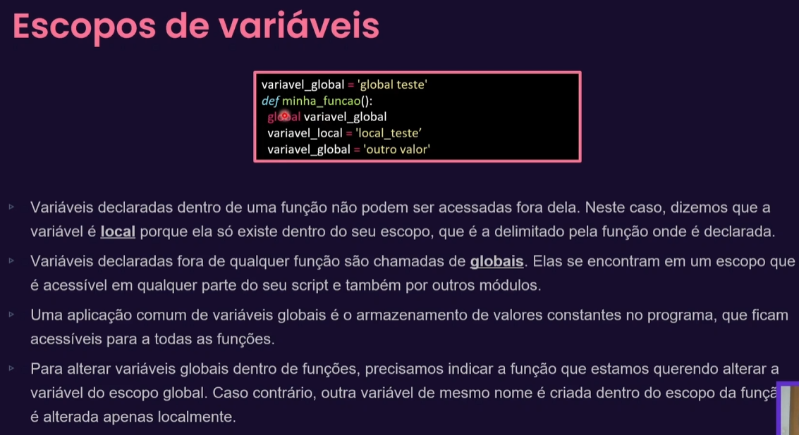

# Começando!

## Modulos e Namespaces:
- O que são modulos?
  - são locais onde iremos definir nomes de variaveis e funções que vai ficar visivel para todo o meu sistema
  - é espaço para declaração de nomes (ai que bem o namespace)
  - Basicamente vamos reutilizar isso em outros arquivos python
  
- boas praticas:
  - ao importar algo de outro arquivo, devemos ESPECIFICAR o que queremos reutilizar, importar tudo usando * não é
  uma boa. Exemplo:
  

    
## Pacotes
- coleção de modulos que foi disponibilizado de forma pub (lib)
- Pip

## Escopos de variaveis
- 

## classes e objetos
- 
- 
- 
- 
- 

 ## Diferença de função para método:
    - Função: é algo que faz algo
     - Método: é associado diretamente a uma classe e ele tem que atuar sobre um objeto
     - O primeiro parametro de um método é sempre o self (o self representa o objeto que eu estou atuando)

- Um pouco mais sobre o self: 
  - 

# Modelagem de um sistema orientado a objetos
- 
- 
  - Modelagm é o processo de identificar os atores, os dados necessarios e o tipo de interação que está ocorrendo
  para criar um sistema é necessario conhecer suas regras de negocio.

- Exemplo:
  - 
  - 