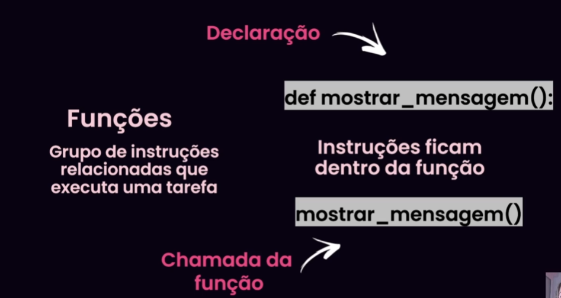

# Introdução

Atraves de funções a gente consegue organizar as atividades especificas

# Parametros:
- Basicamente é colocar dentro dos parenteses da função

# Manipulação de arquivos
- salvando resultados dentro de um arquivo:
  - ocorre três processos:
    - open -> 
    - escrita
    - leitura