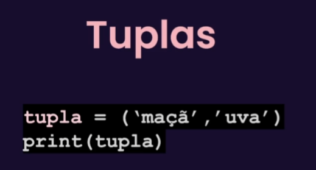
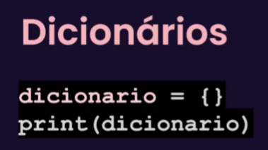

# Listas já tenho em mente como funciona;

# tuplas:

- tuplas são listas que não podem ter valores alterados!
- sintaxe:
  - 

# dicionarios:
- sintaxe:
  - 

## Sobre os temas a cima:
- Se queremos apenas salvar os dados = lista
- se queremos usar para salvar os dados, mas garantir que eles não devem ser alterados = Tuplas
- se tivermos mais de um dado referente a um conjunto = Dicionario

